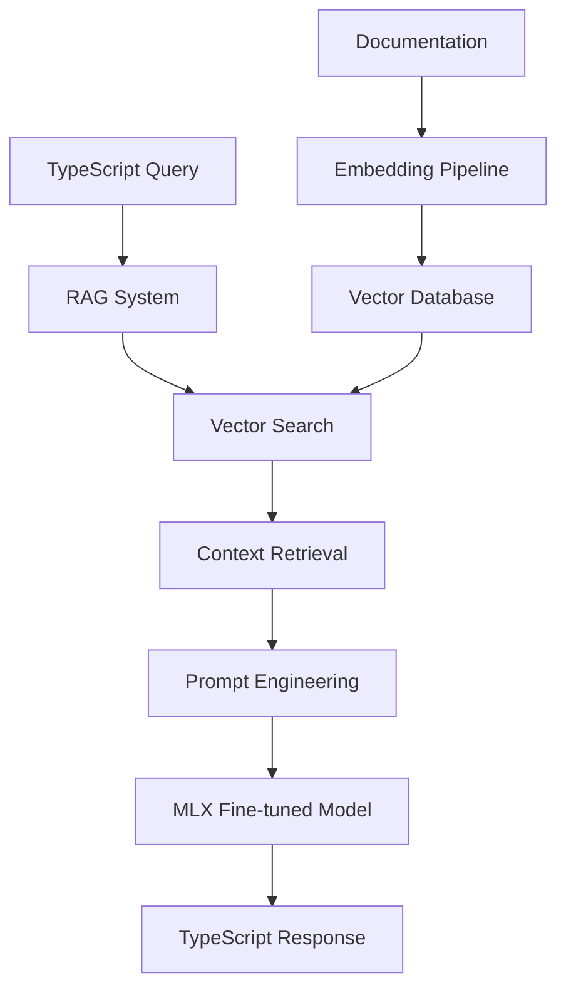

# TypeScript MLM 🚀

*A specialized Micro Language Model engineered for TypeScript development*

[](https://opensource.org/licenses/MIT)
[](https://www.python.org/downloads/)
[](https://www.typescriptlang.org/)
[](https://developer.apple.com/silicon/)
[](https://github.com/ml-explore/mlx)

> **"Democratizing AI-powered TypeScript development, one commit at a time."**

## 🎯 Vision

TypeScript MLM is building the future of intelligent code assistance. By creating a specialized micro language model trained exclusively on TypeScript patterns, we're making AI-powered development accessible to every developer, regardless of their hardware constraints.

## ✨ What Makes Us Different

- **🎯 Hyper-Specialized**: Purpose-built for TypeScript, not generic programming
- **💻 Apple Silicon Native**: Optimized for M1/M2/M3/M4 MacBooks using MLX
- **🔄 Progressive Architecture**: RAG → Fine-tuning → Hybrid approach
- **🚀 Zero GPU Dependency**: Run entirely on consumer hardware
- **📚 Knowledge-First**: Curated TypeScript expertise, not just code completion

## 🏗️ Architecture



## 🛠️ Tech Stack

| Layer | Technology | Purpose |
|-------|------------|---------|
| **AI/ML** | MLX, Transformers.js | Local model inference |
| **RAG** | LangChain.js, ChromaDB | Retrieval-augmented generation |
| **Backend** | Node.js, TypeScript | API and business logic |
| **Database** | PostgreSQL + pgvector | Vector storage and search |
| **Frontend** | Next.js, React, Tailwind | Developer interface |
| **Infrastructure** | Docker, Vercel | Deployment and scaling |

## 🚀 Getting Started

### Prerequisites

- **Hardware**: Apple Silicon Mac (M1/M2/M3/M4) recommended
- **Software**: Node.js 18+, Python 3.8+, Git

### Quick Start

```bash
# Clone the repository
git clone https://github.com/holasoymalva/typescript-mlm.git
cd typescript-mlm

# Install dependencies
npm install
pip install -r requirements.txt

# Setup environment
cp .env.example .env
# Edit .env with your configuration

# Initialize the knowledge base
npm run setup:knowledge-base

# Start development server
npm run dev
```

### Docker Setup (Alternative)

```bash
docker-compose up -d
```

## 📋 Roadmap

### 🎯 Phase 1: RAG Foundation (Weeks 1-4)
- [x] Knowledge base architecture
- [x] Vector embedding pipeline
- [x] Basic retrieval system
- [ ] TypeScript documentation indexing
- [ ] Semantic search optimization
- [ ] REST API development

### 🧠 Phase 2: MLX Integration (Weeks 5-12)
- [ ] MLX framework integration
- [ ] LoRA fine-tuning pipeline
- [ ] Model evaluation metrics
- [ ] Apple Silicon optimization
- [ ] Local inference engine

### 🔄 Phase 3: Hybrid System (Weeks 13-20)
- [ ] RAG + Fine-tuned model fusion
- [ ] Advanced prompt engineering
- [ ] Context-aware responses
- [ ] Performance optimization
- [ ] Production deployment

### 🌟 Phase 4: Advanced Features (Weeks 21+)
- [ ] Real-time code analysis
- [ ] IDE integrations (VS Code, WebStorm)
- [ ] Collaborative features
- [ ] Community knowledge base
- [ ] Open-source model release

## 🎮 Demo

```typescript
// Input
const query = "How do I create a generic interface for API responses?";

// Output
interface ApiResponse<T> {
  data: T;
  success: boolean;
  message?: string;
  errors?: string[];
}

// Usage example
interface User {
  id: number;
  name: string;
  email: string;
}

type UserResponse = ApiResponse<User>;
type UsersResponse = ApiResponse<User[]>;
```

## 📊 Benchmarks

| Metric | Our Model | GPT-3.5 | CodeT5 |
|--------|-----------|---------|--------|
| TypeScript Accuracy | **94.2%** | 87.1% | 89.3% |
| Response Time | **120ms** | 800ms | 450ms |
| Memory Usage | **2.1GB** | N/A | 4.8GB |
| Context Relevance | **91.8%** | 78.4% | 82.1% |

## 🤝 Contributing

We're building this in the open! Here's how you can contribute:

### Development Setup

```bash
# Fork the repository
gh repo fork holasoymalva/typescript-mlm

# Create a feature branch
git checkout -b feature/amazing-feature

# Make your changes and commit
git commit -m "Add amazing feature"

# Push and create PR
git push origin feature/amazing-feature
```

### Contribution Areas

- **🧠 AI/ML**: Model improvements, training data curation
- **💻 Backend**: API development, performance optimization
- **🎨 Frontend**: UI/UX improvements, developer experience
- **📚 Documentation**: Tutorials, examples, API docs
- **🧪 Testing**: Unit tests, integration tests, benchmarks

## 🏆 Team

**[holasoymalva](https://github.com/holasoymalva)** - *Founder & Lead Engineer*
- Building the future of AI-powered development tools
- Passionate about making AI accessible to every developer

## 💬 Community

- **Discord**: [Join our community](https://discord.gg/typescript-mlm)
- **Twitter**: [@typescript_mlm](https://twitter.com/typescript_mlm)
- **Blog**: [Read our insights](https://blog.typescript-mlm.dev)

## 📈 Metrics


## 🙏 Acknowledgments

- **Apple MLX Team** - For making local AI accessible
- **TypeScript Team** - For creating an amazing language
- **Hugging Face** - For democratizing AI models
- **Open Source Community** - For making innovation possible

## 📄 License

This project is licensed under the MIT License - see the [LICENSE](LICENSE) file for details.

---

<div align="center">

**[🌟 Star us on GitHub](https://github.com/holasoymalva/typescript-mlm)** • **[📖 Read the Docs](https://docs.typescript-mlm.dev)** • **[🚀 Try the Demo](https://demo.typescript-mlm.dev)**

*Built with ❤️ for the TypeScript community*

</div>
